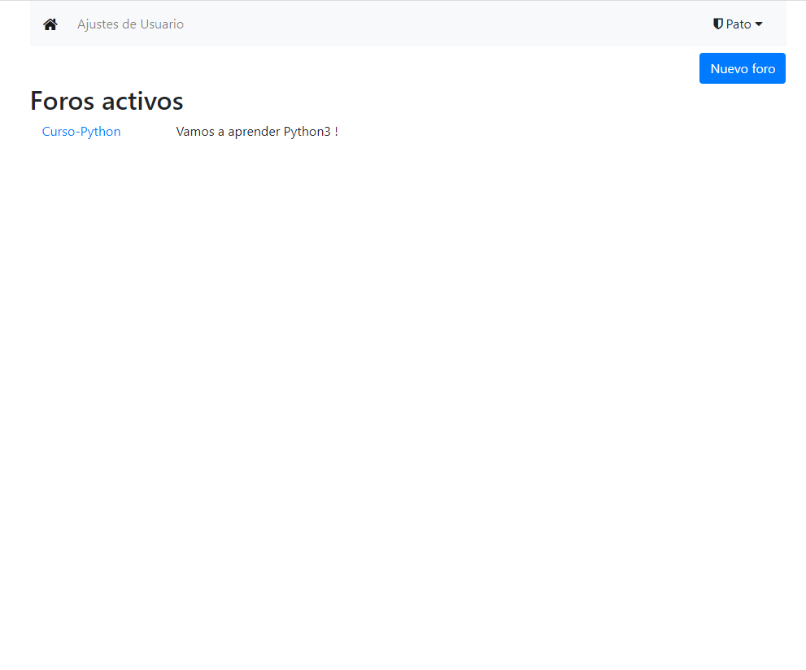
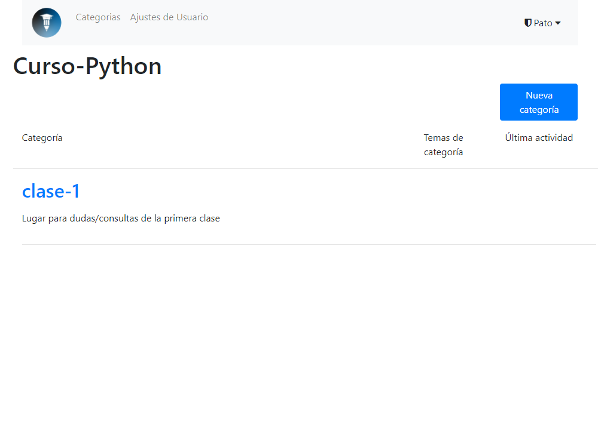
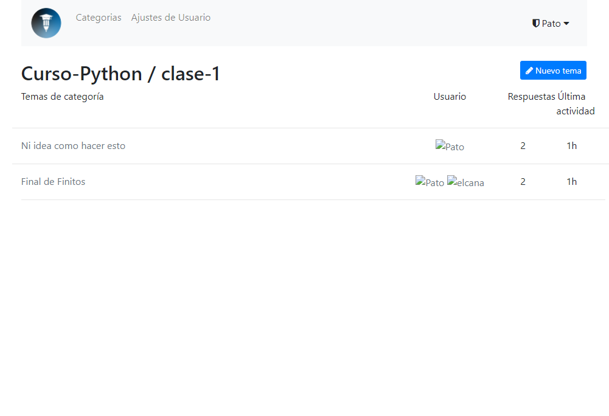
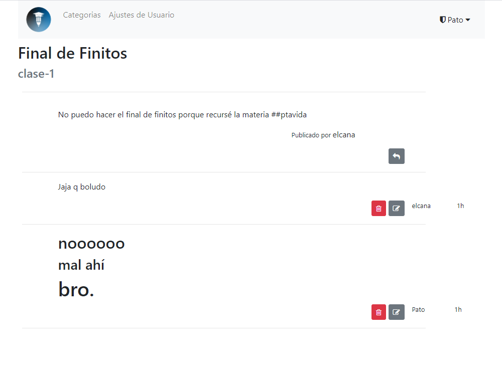

# curso: a saloon homage

[](https://goreportcard.com/report/github.com/IEEESBITBA/Curso-de-Python-Sistemas)

A place to chat and communicate. Basically, a forum.
---
This is a [Buffalo](https://gobuffalo.io/) application based heavily on the excellent
but now derelict [go-saloon/saloon](https://github.com/go-saloon/saloon).

It uses Postgres SQL database and OAuth2 using goth.

Thanks to Sebastian Binet and the go-saloon authors for providing a sturdy foundation for this forum app.

## Looks

### Homepage

### Categories

### Topics

### Replies on topic


# How to run application (static binary)
The app can be run from a binary (.exe on windows) without any need of installation. If you choose to do this you will forgo development capabilities. To do this you must download the [assets](./assets) folder from the github repository and the [latest release](https://github.com/IEEESBITBA/Curso-de-Python-Sistemas/releases) for your operating system. Keep the binary and `assets` in the same directory. You'll also need to have Postgres running. The simplest way to do this is by downloading docker and following [these steps to setup a database](#database-setup). To run migrations on the db you can use the binary file with the `migate` argument once postgres is running.

```bash
./curso-binary migrate 
```

Look at step 7 for environment configuration. 

# Steps to run the server and develop it

1. First step is to install `go` from [golang.org](https://golang.org).

2. Install buffalo from [buffalo.io](https://gobuffalo.io).

3. Install front-end package managers and build tools. If you are
running a linux machine you'll only need `yarnpkg`. If you are running
windows things might get hairy (see windows front end intallation at
the end of this document)
	```bash
	sudo apt install yarnpkg
	```

4.  Clone this repo on your machine
	```bash
	git clone https://github.com/IEEESBITBA/Curso-de-Python-Sistemas
	```

5. Run the following command in `~/Curso-de-Python-Sistemas` directory. This will install `buffalo-pop` which is the defacto database manager plugin for buffalo. This will enable you to run `buffalo pop <cmd>` commands
	```
	buffalo plugins install
	```

6. Create your database according to [`database.yml`](./database.yml) config file. The following section explains how to do that, for now I'll assume you have a SQL database up and running according to `database.yml`.

7. Setup the environment. This server support containerization with
[soypat/gontainer](https://github.com/soypat/gontainer) (requires
a linux filesystem to get running. Alpine Linux is recommended.)
    
    ```shell script
    # Required for OAuth2 (Default uses google as provider)
    GGL_SECRET_FORUM=xxxxxxxxx # This is google's secret API token (client secret)
    GGL_KEY_FORUM=1113333333-xXxXxXXX  # This is google's client ID
    # See other provider env in actions/auth.go under init() function
   
    # Optional
    # Nothing below this line is required to make the server work
    # --------------
    GONTAINER_FS=/home/myuser/alpinefs # Path to linux filesystem with python3 installation
    FORUM_HOST=https://my.site.com  # If hosting on non-local address this is required for proper callback function
    PORT=3000 #Default
    ADDR=127.0.0.1 # Default
   
   # SMTP server (as would be set in ~/.bashrc)
   # Set this up if you want replies to trigger notification Email
   export CURSO_SEND_MAIL=true
   export SMTP_PORT=587 #for google
   export SMTP_HOST=smtp.gmail.com
   export SMTP_USER=miusuario@itba.edu.ar
   export SMTP_PASSWORD=abc123
   export CURSO_MAIL_NOTIFY_REPLY_TO=donotreply@ieeeitba.org
   export CURSO_MAIL_NOTIFY_MESSAGE_ID=ieeeitba.org
   export CURSO_MAIL_NOTIFY_IN_REPLY_TO="Curso de Python 2020 - 2C"
   export CURSO_MAIL_NOTIFY_LIST_ID="Notificaciones Foro <cursos.ieeeitba.org>"
   export CURSO_MAIL_NOTIFY_LIST_ARCHIVE="https://curso.whittileaks.com"
   export CURSO_MAIL_NOTIFY_SUBJECT_HDR="Te han respondido - Curso de Python"
   export CURSO_MAIL_NOTIFY_FROM=cursos_IEEE@itba.edu.ar # Configurar alias para usar este campo. Si no configuro el alias: usar ${SMTP_USER} para esta variable
    ```
    
    It is worth noting if `GONTAINER_FS` is not set the server will use the system
    python installation. `gontainer` requires linux to run. 
    
    For more information on SMTP see [`mailers/mailers.go`](./mailers/mailers.go).
    
8. Run `buffalo dev` in the project directory (as `root` on linux if using `gontainer`). Wait a couple seconds for the following lines to show up

	```log
	INFO[2020-09-12T16:48:58-03:00] Starting application at http://127.0.0.1:3000
	INFO[2020-09-12T16:48:58-03:00] Starting Simple Background Worker
	```

9. Enjoy your forum at [127.0.0.1:3000](http://127.0.0.1:3000/).
To add an admin login to the site and see section on [accessing the database](#access-the-database)

**Some ending notes**  
Buffalo ships with the `dev` command that will watch your application and automatically rebuild the Go binary and any assets for you. That's useful when developing.
Keep in mind buffalo logs are default ANSI encoded for pretty colors. This can be turned off in logger config if you prefer simple logs. 
To view ANSI logs you can get Sublime editor and install [AnsiEscape](https://github.com/aziz/SublimeANSI) plugin.

### Database setup

One needs a database to run `curso`.
Here is an example, running postgres inside a docker container:

```
$> docker run --name forum-postgres -e POSTGRES_PASSWORD=1337 -p 5432:5432 -d postgres
```

or optionally you can straight up create the curso db to not have to let 
buffalo create it on it's own: 

```bash
docker run --name forum-postgres  \
-e POSTGRES_PASSWORD=1337 \
-e POSTGRES_USER=pato \
-e POSTGRES_DB=curso \
-p 5432:5432 -d postgres
```

with this you are ready to run `buffalo pop migrate` and start up your application!

After commit fc0bdb9 `buffalo pop migrate` creates a default 'Curso' forum with a category so users can start trying it out right away.

### Create your databases the hard way

If you did not create a database with `POSTGRES_DB` and `POSTGRES_USER` environment variables set then you must create the database beforehand. Remember the default docker `POSTGRES_USER` and `POSTGRES_DB` is `postgres` (for both) so you should change your `database.yml` file to match that. 

Ok, so you've edited the `database.yml` file and started postgres, now Buffalo can create the databases in that file for you:

```
$> buffalo pop create -a
```

You can now run `buffalo pop migrate` to initialize the forum and the content of its database.

### Access the database
So you probably have the server up and running but probably have no forum to post 
in and are unable to create forums! What a conundrum. To create a forum you need to be
an admin. To do this you first must login to the site. After that access the site through
docker:
```bash
docker exec -it forum-postgres psql -U pato -W curso
```
where `forum-postgres` is the image name, `pato` is the user for the `-U` flag, 
and `curso` is the name of the database. These last two are `postgres` by default
if not explicitly set. If you get an error message you may be getting the username or docker image name wrong. Run `docker ps` for a list of images currently running.

Now you are in the SQL console run `FROM users SELECT *;` (caps are not necessary) 
to verify everything is in working condition. You should see your
user show up. Now you can run the update command to admin yourself:
```sql
UPDATE users 
SET role='admin'
WHERE email='patty.w@crazymail.gov.zm';
```
Remember the trailing semicolon to execute the query. 
`UPDATE 1` should print to console showing the query was successful.
Now refresh the page and see if it works!

### Pinning a topic
We can use SQL. Access the database as seen in the previous section and run
```sql
UPDATE topics 
SET created_at='2020-09-21 17:45:30.447654'
WHERE id = '4c8c42c6-9b61-4491-adca-547d576a19cf';
```
where the long number is the topic UUID. It appears in the topic's url so it should be easy to copy. To set how long the post is pinned just add the number of days to the current date. For example, if today is the 28th of September 2020 and I wanted the post to be pinned a month or so then `created_at` could be set to `'2020-10-28 23:00:00.000000'`. This will work since topics are organized by date published and older topics are sorted last.

## Windows Front-end packages
1. Install scoop! minimalistic package manager
2. `scoop install nodejs`
3. `scoop install yarn`
4. `npm` gotta have python and c++ build tools for `node-sass`, don't ask me why, windows sucks. Run following in powershell in admin mode
```
npm install -g node-gyp
npm install --global --production windows-build-tools
```

## Altering tables in production
If one wanted to add functionality to, say, topics one should modify the `models/table.go` file
and add column name. Then when implemented in the server back end code one should simply
use the `ALTER TABLE` command in postgres console.

```sql
ALTER TABLE topics
   ADD archived BOOL NOT NULL
   CONSTRAINT archived_d DEFAULT FALSE;
```
where `BOOL` is the datatype. Remember to specify if the field can be null.
You can check out commit [`6b6809a`](https://github.com/IEEESBITBA/Curso-de-Python-Sistemas/commit/6b6809a08e124a4d78fe56c0f6a08312278e183f) or `fc0bdb9` when this change was made for a real life example of what was changed.

If you accidentally contrain the column badly or regret the column creation in any way one can 
drop the column using

```sql
ALTER TABLE table_name 
DROP COLUMN column_name;
```

## how i did this
Don't bother reading this. These are notes for myself if I ever try building a new buffalo app in the future.

`buffalo new curso` then `cd curso`


`buffalo pop g model user name nick provider provider_id email role subscriptions`
-> modify `models/user.go` -> change subscriptions to `slices.UUID` type. change
all types that are not fit for default datatype.

migration for `users`
```
create_table("users") {
    t.Column("id", "uuid", {primary: true})
    t.Column("name", "string", {})
    t.Column("nick", "string", {})
    t.Column("provider", "string", {})
    t.Column("provider_id", "string", {})
    t.Column("email", "string", {})
    t.Column("role", "string", {})
    t.Column("subscriptions", "varchar[]", {"null": true})
    t.Timestamps()
}
add_index("users", ["provider", "provider_id", "role"], {"unique":true})
```
`buffalo pop migrate`

Same goes for other db tables. `buffalo pop g model forum title description logo defcon staff`. db type for `[]byte` is `blob`


